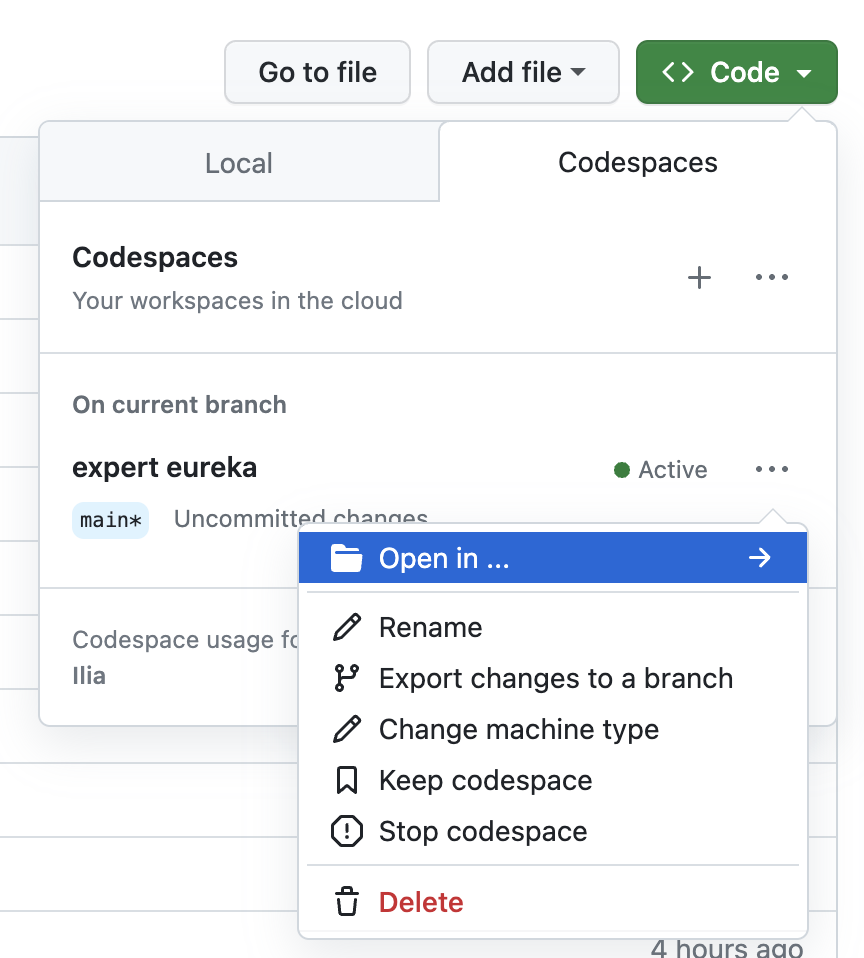
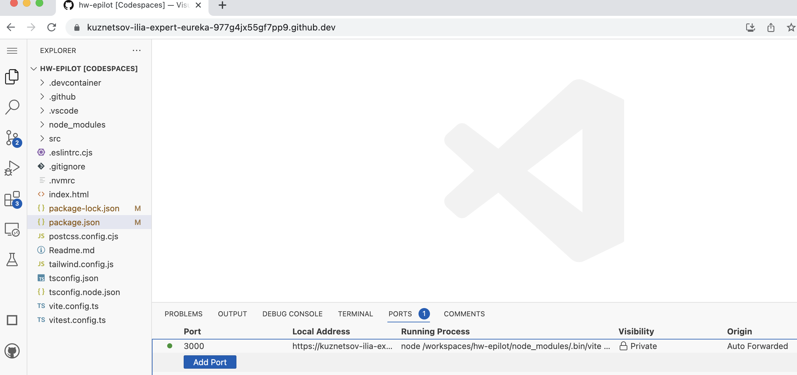
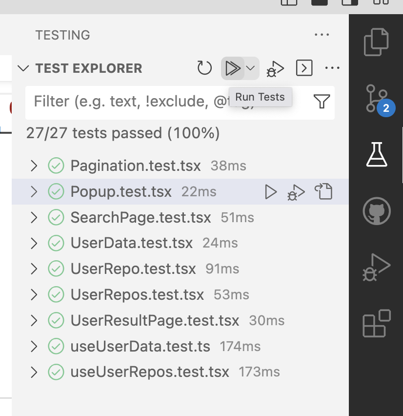

# GitHub User Repositories App

This is a small React app that displays the public repositories of a GitHub user. It consists of two pages: a User Search Page and a User Result Page. The app utilizes the GitHub API to fetch user information and repositories.

## Features

- User Search Page: Allows users to search for GitHub users by their username.
- User Result Page: Displays user information, including user photo, username, repositories count, and a list of paginated repositories.
- Pagination: Repositories are displayed in a paginated manner, with a configurable number of repositories per page.
- Caching: To optimize API usage and avoid reaching the limit of GitHub API rate, all requests are cached in IndexedDB or LocalStorage. This caching mechanism helps reduce unnecessary API calls by storing the fetched data locally, allowing for faster subsequent retrievals and a smoother user experience.


## Prerequisites
1. git and nodejs installed
2. node version 18 (use nvm if you have different)

## Installation

1. Clone the repository:

```bash
git clone https://github.com/Kuznetsov-Ilia/hw-epilot.git github-user-repositories
``````

2. Navigate to the project directory:

```bash
cd github-user-repositories
``````
3. Install the dependencies:

```bash
npm install
```

## Usage
Start the development server:

```bash
npm run dev
```

1. Open your browser and visit http://localhost:3000. (the browser window will be automatically openned)

2. Enter a GitHub username in the search input on the User Search Page and click the "Search" button.

3. The app will fetch and display the user's repositories on the User Result Page.


## Technologies Used
- React: defined by task.
- Vite: fast and standard for now.
- Tailwind CSS: simplest.
- Fetch API: simplest.
- Vitest: fast, jest compatible.

## Development Environment
- Preferred Editor: Visual Studio Code
- Simply install the recommended extensions to enhance your development experience.


# Decisions
1. On the search page i did not implement input validation, it is just required to have at least 1 symbol. a better way is to check if user exists before doing navigation to the result page. anyway we need to check if user exists on the result page as we have a dedicated link to it.
2. I am using native fetch as it is supported by nodejs since v18. in a larger project would probably use axios or smth else depending on real needs.
3. because of lack of time some of features were not implemented:
- AbortController for any request in useEffect
- isMounted checks in the same place
- Advanced error checkups (according to github api spec)
- e2e tests for pages (unit tests are not that good in long perspective)
- debounce on the input on the search screen
- test coverage close to 100%
- cache invalidation strategy


## Codespaces
you make want to open the project without installing dependancies:

there are only 2 tested options here: vscode and browser

### In browser
Make sure your local port 3000 is forwarded



### test explorer
the easiest way to see all the test:


### troubleshouting
if for some reasons codespaces does not work for you and you are still obsessed with the idea you need it, here are the docs:
https://docs.github.com/en/codespaces/developing-in-codespaces/forwarding-ports-in-your-codespace